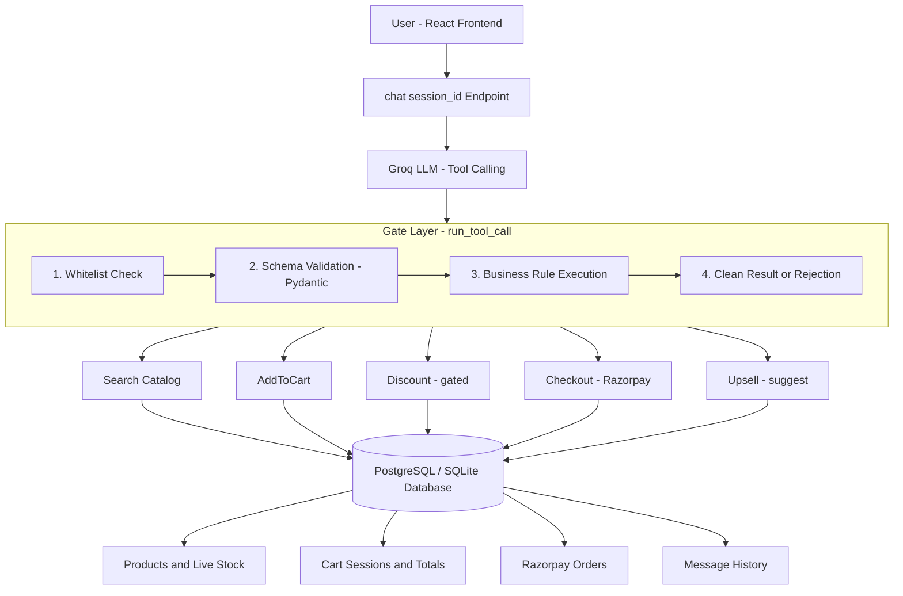

# CartRight: Conversational Checkout Agent

## Tech Stack


**CartRight** is an intelligent, LLM-powered ecommerce checkout assistant featuring a robust business-logic gate layer and seamless Razorpay payment integration. 

Built for our hackathon submission, this project demonstrates a highly secure, reliable, and user-friendly way to shop, add products, apply discounts, and checkout—all through natural language.

---

## Features & Innovations

### 1. The Gate Layer (Core Innovation)
LLMs are prone to hallucinations. We built a robust validation layer that sits between the LLM and the backend. Every tool call is:
- **Whitelisted**: Only registered tools are permitted execution.
- **Schema-Validated**: Pydantic strictly enforces parameter constraints (e.g., maximum discount rules).
- **Business-Rule Gated**: Validates live inventory, stock requirements, and valid cart totals before executing.
- **Cleanly Rejected**: Instead of crashing or ignoring the LLM, the gate returns structured JSON explaining *why* a call failed, allowing the AI to organically course-correct and respond to the user.

### 2. Conversational Ecommerce
Users communicate with a Groq-powered LLM, which autonomously orchestrates:
- **Catalog Search**: Navigating thousands of products based on natural language queries.
- **Cart Management**: Precision adds/removes based on live stock.
- **Smart Promos**: Dynamic discount generation and application.

### 3. Real Payment Processing
Deeply integrated with the **Razorpay SDK** (Test Mode). The agent provisions secure sessions, sets up the order payload, verifies webhooks & signatures, and confirms payments instantly in the frontend.

---

## Architecture Highlights



---

## Quick Start — Local Development

### Prerequisites
1. Python 3.10+
2. Node.js & npm (for frontend)
3. A Razorpay Account (API Key Id & Secret for Test Mode)
4. A Groq API Key

### Backend Setup

```bash
# 1. Create a Python virtual environment
python3 -m venv .venv
source .venv/bin/activate

# 2. Install dependencies
pip install -r requirements.txt

# 3. Setup environment variables defining API keys
export GROQ_API_KEY="your-groq-api-key"
export RAZORPAY_KEY_ID="your-razorpay-key"
export RAZORPAY_KEY_SECRET="your-razorpay-secret"
export DATABASE_URL="sqlite:///./cartright.db"

# 4. Seed database with catalog products & discount rules
python3 seed.py

# 5. Start the FastAPI backend
uvicorn app.main:app --reload --host 0.0.0.0 --port 8000
```

### Frontend Setup

```bash
# 1. Navigate to frontend directory
cd frontend

# 2. Install Node dependencies
npm install

# 3. Start the Vite React app
npm run dev
```
*The frontend runs on `http://localhost:5173`.*

---

## 🤖 Seeing It In Action

### Option 1: REST API Demo Script
We've included an end-to-end Python demo script that simulates the exact REST timeline (Search -> Add -> Discount -> Checkout) to demonstrate gating, independent of the LLM.

```bash
# Ensure backend is running, then in a new terminal:
python3 demo.py
```

### Option 2: The Conversational Chat
Interact with the frontend UI or run the integration chat demo locally:
```bash
python3 test_chat.py
```

---
